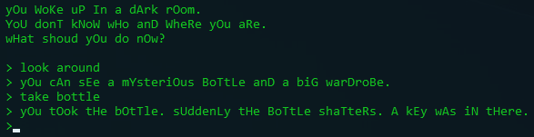

# Text-based Game Builder

Ein Programm, mit dem [text-basierte Spiele](https://en.wikipedia.org/wiki/Text-based_game) erstellt werden können.

## Features

- graphisches Interface
- hohe Anpassbarkeit der Komponenten
- objektorientierte Spielstruktur
---
Der User kann Objekte und Räume definieren, die er mit benutzerdefinierten Eigenschaften versehen kann. Die Räume und Objekte werden im GUI
als Boxen visualisiert, die Verbindungen zwischen den Räumen als Linien. So soll eine gewisse Übersichtilichkeit
garantiert werden. Der User verleiht dem Spiel durch Events Dynamik. Diese Events können mit Objekten und Räumen verbunden
und deren Eigenschaften verändern, können aber auch an globale Bedingungen und Aktionen des Spielers verknüpft sein.

> Bild von der geplanten Oberfläche

Als Produkt erhält der User ein Konsolen-ähnliches text-basiertes Spiel als eigenständige Datei.




## Zielgruppes

Das Programm richtet sich an Leute, die ein Interesse an der Erstellung von interaktiven Geschichten haben und aber auch zumindest ein
grundlegendes Verständnis von Computern und Programmabläufen haben.

## Konkurrenz-Produkte im Vergleich

- [Quest](http://textadventures.co.uk/quest)

Unser Programm soll anders als beim obiger App, eine übersichtliche, leicht verständliche graphische Oberfläche besitzen,
die einfach und praktisch zu bedienen sein soll.

## Technisches

Das Programm basiert grundlegend auf dem gleichen Prinzip, das auch der User in einer bestimmten Weise anwendet.
Es kommt eine Klassenstruktur zum Einsatz, die sowohl im Python-Code als auch in der Speicherung der Daten in einer XML-Datei zum Einsatz.
Die Objekte werden am Anfang des Spiel aus der XML-Datei geladen und in Python-Objekte umgewandelt und am Ende des Spieles wieder in ein XML-Format überführt.

#### Objekthierarchie

Die Objekte sind wie folgt organisiert:

* `World` : enthält alle Raumobjekte, sowie globale Eigenschaften und Events
* `Room` : ein Raumobjekt, identifiziert durch eine einzigartiges id-Argument, enthält spezifische Eigenschaften
und Events, außerdem Objekte
* `ActiveRoom` : ist das Raumojekt, das zusätzlich das Player-Objekt enthält, der Spieler befindet sich also gerad ein diesem Raum
* `Player` : hat Eigenschaften und Events, besitzt weiters ein Inventar, das Objekte enthalten kann
* `Object` : hat eigene Eigentschaften und Events, wird durch ein einzigartiges id-Argument identifiziert und hat eine bestimmten Typ, der im type-Argument festgelegt wird
* `Connection` : repräsentiert eine Verbindung zwischen Räumen, besitzt Eigenschaften, die unter anderem festlegen, welche Räume verbunden werden oder ob sie gesperrt ist,
hat ein einzigartiges id-Argument 

Beispiel für jene Strukutur in der XML-Datei:

```
<world>
    <properties>
        <session>0</session>
    </properties>
    <events></events>
    <connection id="c-0">
        <link>0</link>
        <link>1</link>
        <properties>
            <locked>False</locked>
        </properties>
    </connection>
    <room id='0'>
        <properties>
            <name>Starter Room</name>
            <description>The walls are green.</description>
            <visited>False</visited>
        </properties>
        <events></events>
        <object id='001' type='standard'>
            <properties>
                <name>irgendwas</name>
            </properties>
            <events></events>
        </object>
        <player>
            <properties>
                <name></name>
            </properties>
            <inventory>
            <object id='002' type='test'>
                <properties>
                    <name>Letter</name>
                </properties>
                <events></events>
            </object>
            </inventory>
        </player>
    </room>
<world>
```